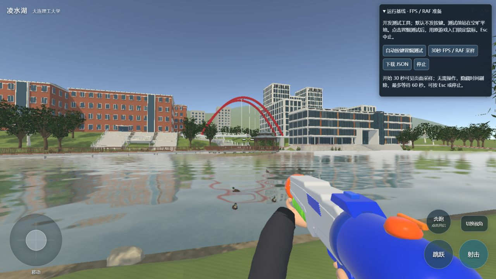
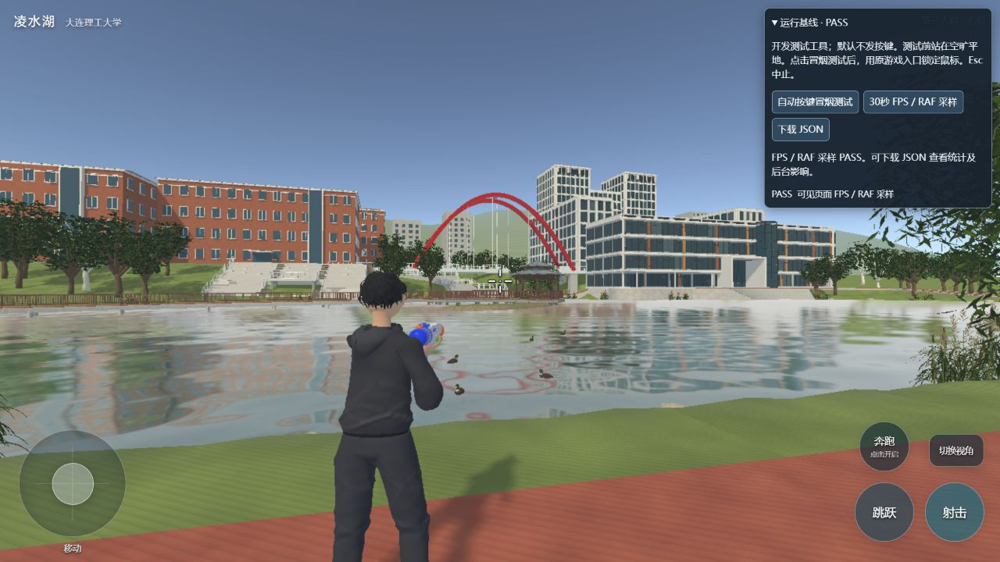
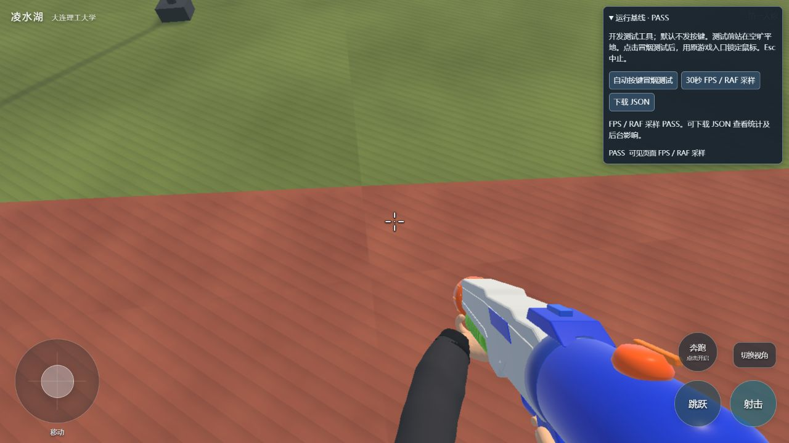

# 本轮基线验收 · 2026-09-20

**可复现基线已建立；运行验收保留已知失败，不能宣称跨帧率行为全部稳定。** 本轮未新增命中玩法，也未改写移动/动画/相机控制器。

## 输入与变更范围

- 输入提交：`8b074607fde912add41031b4904eb740ec516874`。本文件所在提交包含此次基线工具与证据。
- 实际验证目录：`D:\a\baseline-checks\LH-stable-20260920`，从 GitHub `main` 克隆。初始禁用 smudge 得到 125 个 LFS 指针；执行 `git lfs pull` 后剩余 0 个，`git lfs fsck --objects` 通过。
- 未复制原工程的 `library/local/release/bin/js/bundles`。最终候选冷构建前，这四个目录均不存在，见[原生冷构建结果](runs/20260920/cold-web-build.json)。之前的试构建缓存仅移到验证目录自己的忽略目录中保存。
- 新目录最初受 Windows 自动换行影响，336 个文件发生检出换行转换；从**该 clone 的 Git 对象**恢复原始字节，再通过 `.gitattributes` 固定保留字节。没有从原工作区复制运行资产来掩盖恢复问题，见[换行修复记录](runs/20260920/checkout-eol.json)。
- 588 个锁定文件与输入提交的 Git 内容/LFS 对象逐项一致；现有 `assets/`、`settings/`、运行 `src/`、`source_art/` 无变更。新编辑器辅助类只用于 CLI。
- [641 个验证输入的 SHA-256](runs/20260920/verified-inputs.json)证明工具、配置、引擎类型和运行资源在原目录与验证目录一致。开发探针单独由服务注入，不进入发布游戏 bundle。

本轮新增清单/资源锁、统一准备与导入校验、精确测试依赖、CLI 构建、开发服务与探针、当前文档。旧模型来源、随机 UUID/旧报告驱动写入入口已退役。可选 `com.layabox.layamcp` 不再是项目必装依赖，避免素材商店未登录弹窗。

## 分层结果

| 验证层 | 本轮结果 | 证据与边界 |
|---|---|---|
| 环境 / LFS | PASS | Node 24.16.0、TS 5.9.3、Python 3.12.10、Git LFS 3.7.1、IDE 3.4.1；[环境](runs/20260920/environment.json) |
| 统一自动检查 | **90/90 PASS** | 类型 1、逻辑 67、资源合同 3、引擎源码合同 8、工具入口 11；[汇总](runs/20260920/tests-summary.json) |
| 缺少 IDE 的反例 | **INCOMPLETE，8 项 NOT TESTED** | 82/90 通过、0 失败；不会将缺失引擎检查算 PASS；[反例结果](runs/20260920/tests-without-ide.json) |
| 资源准备与实际导入 | PASS | 最新人物/双臂生成副本匹配；真实 IDE 缓存匹配 44+15+1 mesh、24+2 clip；运行资源写入为 0；[导入](runs/20260920/assets-import.json) |
| Web 冷构建 | PASS | 前置资产 10/10，原生 Success=1；[构建](runs/20260920/cold-web-build.json)、[原生结果](runs/20260920/cold-web-native.json) |
| single-html 构建 | PASS | 原生 Success=1，HTML 46,606,097 字节；署名与完整许可 hash 匹配；[构建](runs/20260920/single-html-build.json) |
| 实际页面加载 / 画面 | PASS（已观察范围） | 新端口 18766 对应新目录；804 渲染网格、1570 静态碰撞、44 玩家网格、15 FPS 网格、5 鸭；[首帧状态](runs/20260920/initial-status.json) |
| 官方 GUI 控件操作 | PASS（已观察范围） | 实际摇杆后退、跳跃/落地、射击按钮、转向、双视角、低头；[原始状态](runs/20260920/real-control-checks.json) |
| 真实引擎 + 合成触屏回路 | **15/15 PASS** | FP 常规帧率回路、TPS 显示中复测各 15 项；输入经过现有触屏监听，非控制器直接调用；[FP](runs/20260920/runtime-touch-smoke.json)、[TPS 复测](runs/20260920/runtime-touch-tps-visible.json) |
| 低帧率运行复核 | **FAIL，保留 3 个失败阶段** | 后退原生状态、一秒连射次数、松开时序；无 JS 异常但行为与观测时序存在差异；[失败原始报告](runs/20260920/runtime-touch-tps-attempt.json) |

自动检查中的 `engine_contract` 只读取安装版引擎源码；它不等于真实物理或渲染。实际运行使用**官方 Codex 内置 Chromium 浏览器**，不是桌面 Edge。Windows Edge 自动操控因无法确认 URL 被工具中止，其浏览器接口的策略加载也失败，未绕过这些限制。

## 功能与性能基线

当前保留：双视角、八方向 Walk/Run 资源、身体跟随视线、Jump/RunJump 与 Land/RunLand、上身连射、独立 FPS 双臂、近距离越肩、水面与鸭群。运行回路实际覆盖八向 Walk、正向 Run、原地跳落地和射击；其余 Run 方向/RunJump/RunLand 本轮主要由自动合同检查覆盖，未逐项做渲染验收。当前水枪只有动作和水流，没有命中、伤害、敌人或弹药系统。

采样环境：Windows 11，i9-14900HX、15.7 GiB 内存，主机有 RTX 5070 Laptop / Intel UHD；未确认浏览器使用的具体 GPU。IAB 报告 Chrome 153.0.0.0，CSS 视口 1280×720、DPR 1.5，游戏 canvas backing 1333×750。[主机](runs/20260920/host.json)和 TPS 复测 environment 有原始信息。原 IDE 和其他应用保持运行，不是隔离硬件基准。

| 场景 | 有效可见时长 | 游戏 HUD FPS | 浏览器 RAF 间隔均值 / P95 |
|---|---:|---|---|
| 第一人称静止看湖 | 30.104 秒 | 28 个一秒样本，min/mean/max 均 60 | 4.226 / 4.3 ms |
| 越肩静止看湖 | 30.095 秒 | 28 个一秒样本，min/mean/max 均 60 | 4.218 / 4.3 ms |

两次采样均无隐藏/失焦时段、无采样期异常。[FP 原始数据](runs/20260920/runtime-first-person-idle.json)、[TPS 原始数据](runs/20260920/runtime-third-person-idle.json)。RAF 是浏览器调度间隔，**不是游戏帧时间或 GPU 帧时**，不能由约 4.2 ms 推断游戏运行在 240 FPS。

### 已知低帧率问题

保留全部尝试，未只挑通过的结果。[运行对比](runs/20260920/runtime-comparison.json)按原始位置和墙钟时间计算：

- 常规 FP 回路：前进峰值报告 1.652 m/s，奔跑 4.000 m/s；一秒长按阶段新增 5 发。
- 低帧 TPS 尝试：样本 FPS 中位数约 13、范围 5～15；Run 阶段位移 10.400 m / 1.101 s（包含停稳观察），一秒长按阶段只有 2 发。**这是实际行为差异，不能全解释为探针漏采。**
- 显示浏览器并关闭本任务四个重复旧预览后，TPS 动作状态回路 15/15 通过；样本 FPS 38～56，但 Run 位移仍为 4.711 m / 1.092 s，速度诊断峰值 12.884 m/s。此回路只断言方向/状态/有效移动，**通过不证明速度上限或跨帧率一致性**。
- 低帧失败的松开阶段连续读取了 8 份相同 HUD，后续已观察到触发与射击指针清空。HUD 在被限制的帧增量下节流，故这项包含观测延迟；不能单凭探针本地集合清空断言游戏立即释放。
- 现有射击时钟每帧使用最多 0.05 秒增量，低帧时一秒墙钟推进的动画时间不足。当前运行代码未被本轮修改；问题留作已知限制，未在本轮调整参数或重写控制器。

因此本轮完成了可复现输入、验证入口和现状记录，**没有把低帧率运动/射击稳定性标成通过**。后续引入命中玩法前，应把该已知问题纳入优先处理范围；本轮在此停止，不实施下一阶段。

## 未验证

- 桌面原生 Pointer Lock 下的鼠标点击/捕获，以及物理键盘长按。GUI 触屏控件成功与合成 PointerEvent 不代表这些路径已实测。
- 手机真机、多指硬件、不同 GPU/浏览器、长时间压力与全场景障碍遍历。
- GPU 专用帧时、显存/内存泄漏、跨帧率运动一致性完整修复。
- single-html 的实际打开运行：另启预览服务及 HTTP 探测被自动审批拒绝，未提供更具体原因；本轮只确认其原生构建与产物/许可。
- 从 Blender 一键重建全部世界修补、碰撞与反射配置。基线通过 Git/LFS 恢复已提交 native 资源，不承诺缺失的作者流程。

CLI 仍输出过“交互式登录在 CLI 模式不可用”的账号提示；移除 MCP 强依赖后的最终冷构建/导入正常结束，未再出现插件安装失败弹窗。早期被弹窗阻断的 import 记录保留在验证目录 `.test-reports/final-import/`，不作为成功结果。

## 本轮画面

历史 `docs/player_*` / `docs/lake_ducks` 报告只作追溯；本页结果全部来自本轮新目录执行与浏览器观察。
